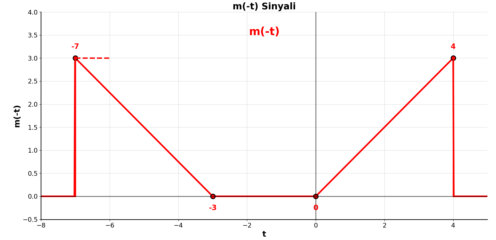
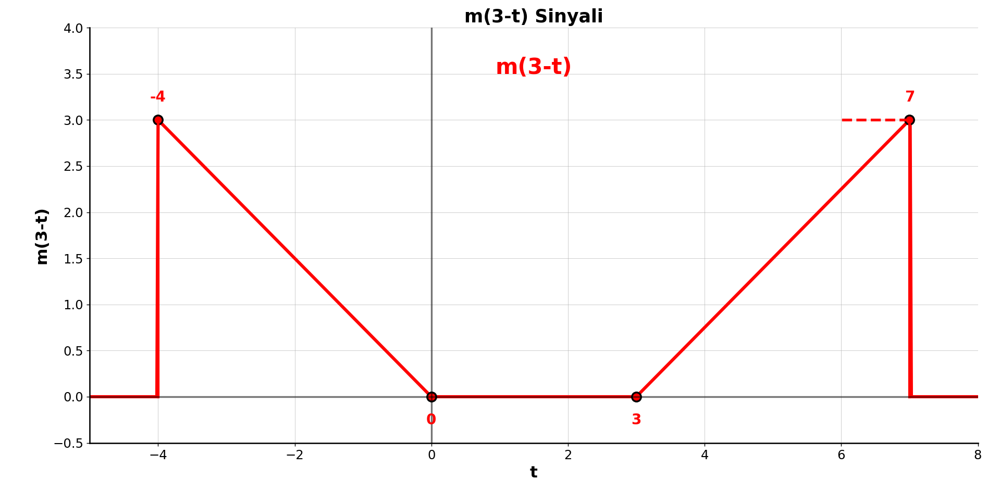
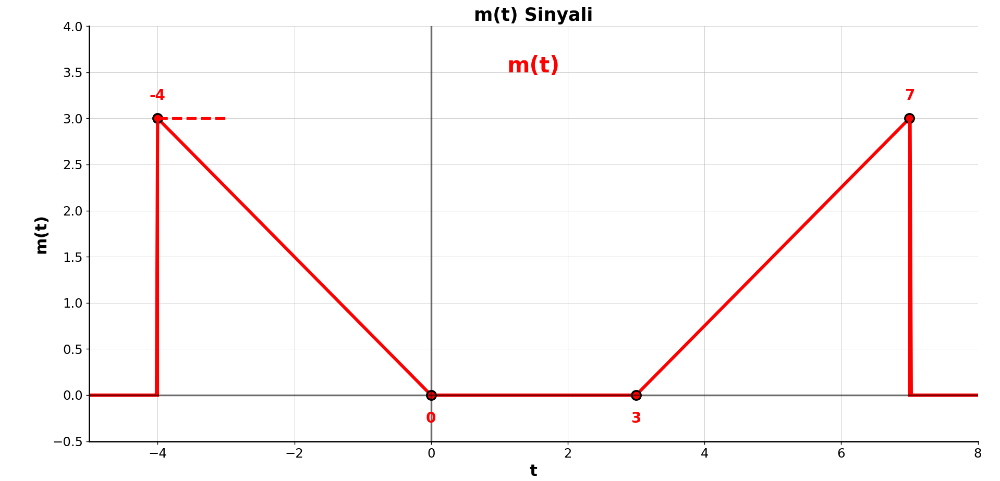
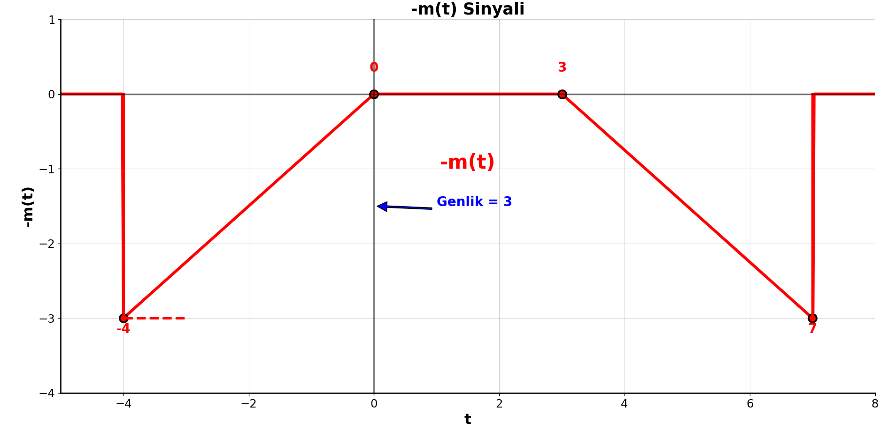
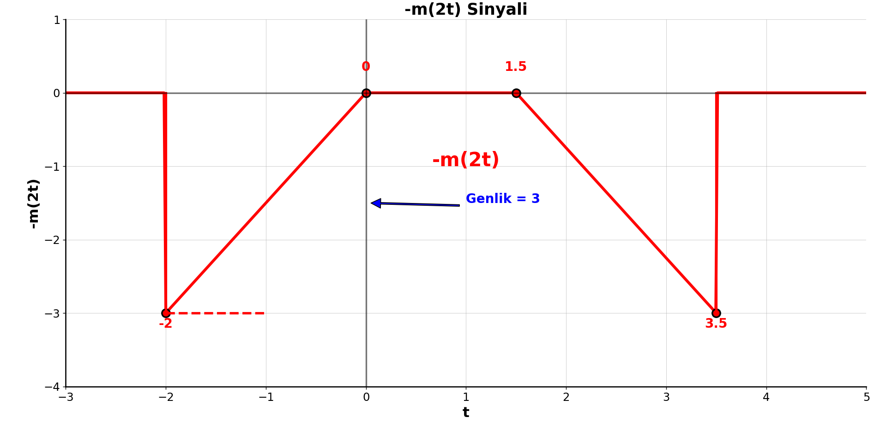
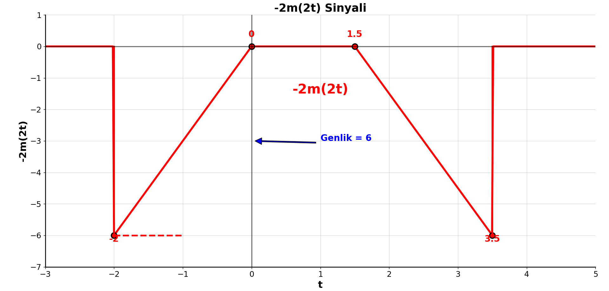

# 📈 Piecewise Linear Functions and Signal Transformations

This repository demonstrates **Piecewise Linear Signals** and their core **Signal Transformations**, which are fundamental topics in signal processing and systems theory.

---

## 📌 Piecewise Linear Functions

Piecewise linear functions are **composed of different linear segments** over defined intervals. They are widely used in:

- Modeling ideal or test signals  
- Signal analysis and synthesis  
- System behavior demonstrations  

---

## 🔁 Fundamental Signal Transformations

These are core operations described in signal processing textbooks like *Oppenheim & Willsky*:

### ⏱️ 1. Time Scaling

Scales the signal along the time axis:

```
x(at)
```

- If |a| > 1 → **Compression** (faster)  
- If 0 < |a| < 1 → **Expansion** (slower)  

### ↔️ 2. Time Shifting

Shifts the signal in time:

```
x(t - t₀)
```

- t₀ > 0 → Right shift (delay)  
- t₀ < 0 → Left shift (advance)  

### 🔄 3. Time Reversal

Flips the signal horizontally:

```
x(−t)
```

### 📶 4. Amplitude Scaling

Scales the signal’s amplitude:

```
a ⋅ x(t)
```

---

## 🛠️ Application Areas

- 🎓 **Signal Processing Education**  
  → Helps students visualize transformations clearly.

- 🧠 **System Analysis**  
  → Understand how systems react to various signal types.

- 🔌 **Electrical and Electronics Engineering**  
  → Core content in analog and digital signal processing courses.

---

## 📚 References

- Oppenheim, A. V., & Willsky, A. S. (1997). *Signals and Systems*. Prentice Hall.  
- Proakis, J. G., & Manolakis, D. G. (2007). *Digital Signal Processing: Principles, Algorithms, and Applications*. Pearson.

---

## 📝 Summary

This code visualizes a **piecewise linear signal** and applies **fundamental transformations** such as scaling, shifting, and reflection. These are foundational concepts in all introductory signal processing courses and are crucial for understanding the behavior of signals in both time and frequency domains.

---

## 🖼️ Example Plot (optional)

If you have a plot image, include it like this:

```








```

